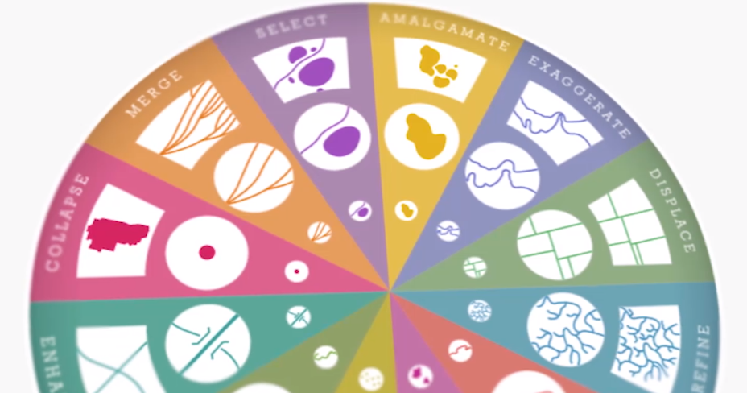

# Esir MOOC Cartography (制图学) {#cartography}

## What is Cartography?

- O-graphy-of-Carto: the communication of a geographic phenomenon.
- C(Compromise)art(Artistry)o(Opportunity)graph(Graphicacy)y(Why).
- The process of map-making. It depends on who you make a map for and why you make this map.

## Maths for Map Makers

- Coordinates, projection. Three major families of map projections including conic, azimuthal, and cylindrical.
- Exploring the map projection is also interesting.
- Web Mercator caused the error of the area. 
- Choices of projection should fit the purpose of the map and intending to show.

## The Language of Graphics

- Generalization.

